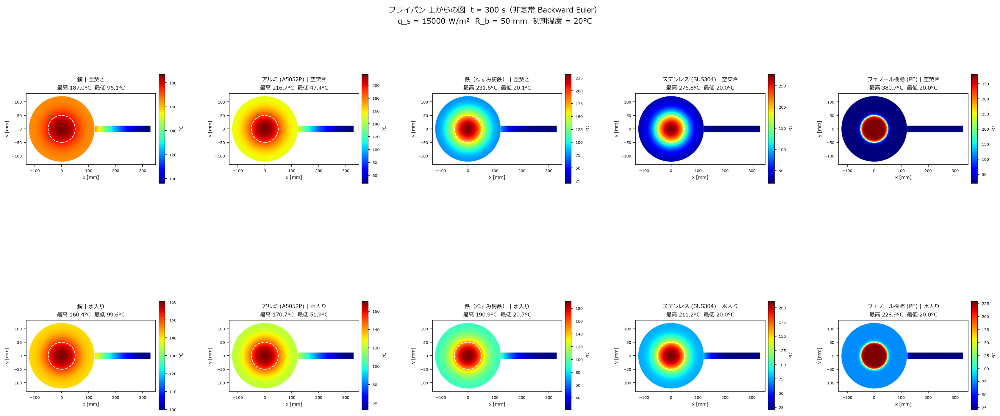

# `top_view_distribution.py` 解説

## 概要

フライパン（円形底面＋円柱持ち手）の**非定常熱伝導**を数値的に解き、t = 300 s 時点の温度分布を2種類の図で出力するスクリプト。

| 出力ファイル | 内容 |
|---|---|
| `top_view_distribution.png` | 上面視カラーマップ（底面＋持ち手合成） |
| `cross_section_distribution.png` | y = 0 断面カラーマップ（板厚方向＋持ち手） |



---

## 解析モデル

```
        ← L=122mm (R=61mm) →← L_h=207mm →
        ┌────────────────────┬────────────┐
        │   円形底面 (2D)    │  持ち手    │
        │  FDM (Ny×Nx 格子) │  (1D フィン)│
        └────────────────────┴────────────┘
        ↑ バーナー加熱 (中央 R_b=50mm)
```

- **底面**：2次元 Backward Euler 有限差分法（FDM）
- **持ち手**：1次元フィン方程式（Backward Euler）
- 両者は根元の境界条件で**連成**（底面端部の温度 → 持ち手根元 BC）

---

## パラメータ一覧（セクション 0）

### 材料（5 種類）

| 材料 | 熱伝導率 k [W/mK] | 密度 ρ [kg/m³] | 比熱 c [J/kgK] |
|---|---|---|---|
| 銅 | 390 | 7700 | 390 |
| アルミ (A5052P) | 137 | 2860 | 880 |
| 鉄（ねずみ鋳鉄） | 45 | 7200 | 510 |
| ステンレス (SUS304) | 16 | 8000 | 500 |
| フェノール樹脂 (PF) | 0.2618 | 1400 | 1900 |

### 境界条件（2 条件）

| 条件 | 空冷面積 | 水冷面積 | 実効 h |
|---|---|---|---|
| 空焚き | A_air = 133547 mm² | — | h_air = 20 W/m²K |
| 水入り | A_air = 88024 mm² | A_water = 45523 mm² | h_air + h_wtr (= 200) |

> **水入り**の実効温度 T_eff は面積加重平均で算出：  
> $T_\text{eff} = \frac{h_w A_w T_w + h_a A_a T_a}{h_w A_w + h_a A_a}$

### 底面（2D 格子）

| 項目 | 値 |
|---|---|
| 底面半径 L | 122 mm（直径 244 mm） |
| 板厚 H | 3 mm |
| 格子点数 Nx × Ny | 122 × 31 |
| バーナー熱流束 q_s | 15000 W/m² |
| バーナー半径 R_b | 50 mm |

### 持ち手（フィン）

| 項目 | 値 |
|---|---|
| 長さ L_h | 207 mm |
| 直径 d_h | 25 mm（円柱断面） |
| 対流係数 h_fin | 10 W/m²K |
| 節点数 Nf | 104 |

### 時間設定

| 項目 | 値 |
|---|---|
| 終了時刻 t_end | 300 s |
| 時間刻み dt | 0.1 s |
| タイムステップ数 Nt | 3000 |

---

## 数値解法

### Backward Euler（陰解法）

各タイムステップで連立1次方程式を解く：

$$\frac{T^{n+1} - T^n}{\Delta t} = \mathcal{L}(T^{n+1}) + f$$

陰解法のため、**無条件安定**（時間刻みを大きくとっても発散しない）。

---

## 関数・セクション解説

### `build_2D(k, rho, c, h_eff, T_eff)` — セクション 1

2D 底面の係数行列を構築し、LU 分解（`factorized`）して返す。

| 境界 | 処理 |
|---|---|
| j = 0（底面、バーナー側） | Neumann BC：フラックス指定（R_b 内は q_s、外はゼロ） |
| j = Ny-1（上面、空気/水側） | Robin BC：対流放熱 h_eff(T - T_eff) |
| i = 0, i = Nx-1（左右端） | 対称 BC（零勾配）：dT/dx = 0 |
| 内部節点 | 標準的な 2D FDM ステンシル |

**内部節点の差分式** ($\rho c \dot{T} = k \nabla^2 T$)：

$$\begin{aligned}
&\frac{\rho c}{\Delta t} T_{i,j}^{n+1} + \frac{2k}{\Delta x^2} T_{i,j}^{n+1} + \frac{2k}{\Delta y^2} T_{i,j}^{n+1} \\
&\quad - \frac{k}{\Delta x^2}(T_{i-1,j}^{n+1}+T_{i+1,j}^{n+1}) - \frac{k}{\Delta y^2}(T_{i,j-1}^{n+1}+T_{i,j+1}^{n+1}) = \frac{\rho c}{\Delta t} T_{i,j}^{n}
\end{aligned}$$

### `build_fin(k, rho, c)` — セクション 2

1D フィン方程式を離散化・LU 分解。

| 境界 | 処理 |
|---|---|
| i = 0（根元） | Dirichlet BC（底面端部の温度を毎ステップ代入） |
| i = Nf-1（先端） | 断熱（零勾配）：dT/dx = 0 |
| 内部節点 | フィン方程式 |

**フィン方程式**（断面積一様、$m^2 = hP/kA_c$）：

$$\begin{aligned}
&\frac{\rho c}{\Delta t}T_i^{n+1} + \frac{hP}{A_c}T_i^{n+1} + \frac{2k}{\Delta x^2}T_i^{n+1} \\
&\quad - \frac{k}{\Delta x^2}(T_{i-1}^{n+1}+T_{i+1}^{n+1}) = \frac{\rho c}{\Delta t}T_i^{n} + \frac{hP}{A_c}T_\infty
\end{aligned}$$

### `run_transient(k, rho, c, h_eff, T_eff)` — セクション 3

時間ループ（3000 ステップ）：

```
for s in range(Nt):
    1. 2D 底面を Backward Euler で更新
    2. 底面右端上面節点 T[Nx-1, Ny-1] を取得（= 持ち手根元温度）
    3. フィンを Backward Euler で更新（根元 = 上記温度）
```

戻り値：
- `T_top_C`：底面上面（j = Ny-1）の温度プロファイル [°C]（長さ Nx）
- `T_fin_C`：持ち手温度プロファイル [°C]（長さ Nf）
- `T_field_C`：2D 温度場全体 [°C]（shape: Ny × Nx）

---

## 可視化

### セクション 5：上面視（`top_view_distribution.png`）

- 円形底面・長方形持ち手をピクセルグリッド（900 × 450）に投影
- 底面：半径 R_comp（= 座標の極半径）で `T_top_C` を補間
- 持ち手：x 方向のみで `T_fin_C` を補間
- カラーマップ：`jet`（青 → 赤）

主な描画要素：
- 白破線円：バーナー境界（R_b = 50 mm）
- 白実線円：底面縁（R = 122 mm）
- 白実線：持ち手縁

### セクション 6：断面図（`cross_section_distribution.png`）

- x 方向：底面直径（−L 〜 L）＋ 持ち手（L 〜 L + L_h）
- y 方向：0 〜 d_h/2 = 12.5 mm（上半分、対称を利用）
- 底面板：`RegularGridInterpolator` で 2D 温度場 T(x, y) を補間
- 持ち手：x 方向のみ補間（y 方向一様と仮定）

主な描画要素：
- 白破線縦線：バーナー境界（±R_b）
- 白実線縦線：底面縁（±L）
- 白点線横線：底面上面（y = H = 3 mm）

---

## 実行フロー

```
パラメータ定義
    ↓
全10条件（5材料 × 2条件）をループで計算・キャッシュ
    ↓
上面視図を描画・保存 (top_view_distribution.png)
    ↓
断面図を描画・保存 (cross_section_distribution.png)
```

---

## 依存ライブラリ

| ライブラリ | 用途 |
|---|---|
| `numpy` | 配列演算・補間 |
| `matplotlib` | グラフ描画（Agg バックエンド） |
| `scipy.sparse` | 疎行列（lil_matrix → CSR 変換） |
| `scipy.sparse.linalg.factorized` | LU 分解（1 回だけ分解、繰り返し求解） |
| `scipy.interpolate.RegularGridInterpolator` | 2D 格子上の双線形補間 |
