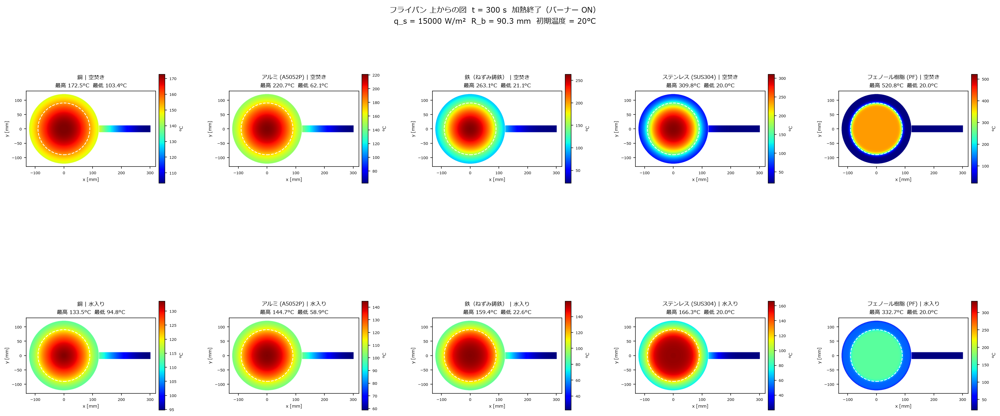
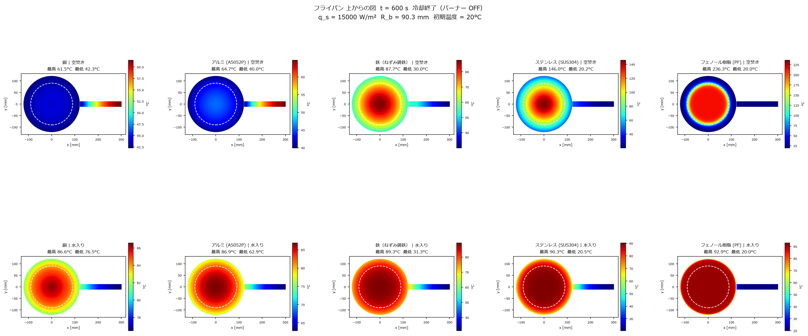

# `cooling_simulation.py` 解説

## 概要

フライパン（円形底面＋円柱持ち手）の**非定常熱伝導**を数値的に解き、加熱・冷却の2フェーズにわたる温度分布を出力するスクリプト。

| フェーズ | 時間 | バーナー |
|---|---|---|
| 加熱 | t = 0 〜 300 s | ON（q_s = 15000 W/m²） |
| 冷却 | t = 300 〜 600 s | OFF（自然対流のみ） |

| 出力ファイル | 内容 |
|---|---|
| `top_view_300s.png` | 上面視カラーマップ t = 300 s（加熱終了時） |
| `top_view_600s.png` | 上面視カラーマップ t = 600 s（冷却終了時） |





---

## 解析モデル

```
        ← L=122mm (R=61mm) →← L_h=207mm →
        ┌────────────────────┬────────────┐
        │   円形底面 (2D)    │  持ち手    │
        │  FDM (Ny×Nx 格子) │  (1D フィン)│
        └────────────────────┴────────────┘
        ↑ バーナー加熱 (中央 R_b=50mm、加熱フェーズのみ)
```

- **底面**：2次元 Backward Euler 有限差分法（FDM）
- **持ち手**：1次元フィン方程式（Backward Euler）
- 両者は根元の境界条件で**連成**（底面端部の温度 → 持ち手根元 BC）

---

## パラメータ一覧（セクション 0）

### 材料（5 種類）

| 材料 | 熱伝導率 k [W/mK] | 密度 ρ [kg/m³] | 比熱 c [J/kgK] |
|---|---|---|---|
| 銅 | 390 | 7700 | 390 |
| アルミ (A5052P) | 137 | 2860 | 880 |
| 鉄（ねずみ鋳鉄） | 45 | 7200 | 510 |
| ステンレス (SUS304) | 16 | 8000 | 500 |
| フェノール樹脂 (PF) | 0.2618 | 1400 | 1900 |

### 境界条件（2 条件）

| 条件 | 空冷面積 | 水冷面積 | 実効 h |
|---|---|---|---|
| 空焚き | A_air = 133547 mm² | — | h_air = 20 W/m²K |
| 水入り | A_air = 88024 mm² | A_water = 45523 mm² | h_air + h_wtr (= 200) |

> **水入り**の実効温度 T_eff は面積加重平均で算出：  
> $T_\text{eff} = \frac{h_w A_w T_w + h_a A_a T_a}{h_w A_w + h_a A_a}$

### 底面（2D 格子）

| 項目 | 値 |
|---|---|
| 底面半径 L | 122 mm（直径 244 mm） |
| 板厚 H | 3 mm |
| 格子点数 Nx × Ny | 122 × 31 |
| バーナー熱流束 q_s | 15000 W/m² |
| バーナー半径 R_b | 50 mm |

### 持ち手（フィン）

| 項目 | 値 |
|---|---|
| 長さ L_h | 207 mm |
| 直径 d_h | 25 mm（円柱断面） |
| 対流係数 h_fin | 10 W/m²K |
| 節点数 Nf | 104 |

### 時間設定

| 項目 | 値 |
|---|---|
| 加熱時間 t_heat | 300 s（3000 ステップ） |
| 冷却時間 t_cool | 300 s（3000 ステップ） |
| 合計時間 | 600 s（6000 ステップ） |
| 時間刻み dt | 0.1 s |

---

## 数値解法

### Backward Euler（陰解法）

各タイムステップで連立1次方程式を解く：

$$\frac{T^{n+1} - T^n}{\Delta t} = \mathcal{L}(T^{n+1}) + f$$

陰解法のため、**無条件安定**（時間刻みを大きくとっても発散しない）。

---

## 関数・セクション解説

### `build_2D(k, rho, c, h_eff, T_eff)` — セクション 1

2D 底面の係数行列を構築し、LU 分解（`factorized`）して返す。  
RHS ベクトルをフェーズ別に **2つ** 用意する点が特徴。

| 変数 | 内容 |
|---|---|
| `b0_heat` | バーナー ON（j = 0 に q_s フラックス） |
| `b0_cool` | バーナー OFF（j = 0 は断熱、対流 BC は同じ） |

| 境界 | 処理 |
|---|---|
| j = 0（底面、バーナー側） | Neumann BC：加熱時は q_s、冷却時は断熱（ゼロフラックス） |
| j = Ny-1（上面、空気/水側） | Robin BC：対流放熱 h_eff(T - T_eff)（両フェーズ共通） |
| i = 0, i = Nx-1（左右端） | 対称 BC（零勾配）：dT/dx = 0 |
| 内部節点 | 標準的な 2D FDM ステンシル |

**内部節点の差分式** ($\rho c \dot{T} = k \nabla^2 T$)：

$$\begin{aligned}
&\frac{\rho c}{\Delta t} T_{i,j}^{n+1} + \frac{2k}{\Delta x^2} T_{i,j}^{n+1} + \frac{2k}{\Delta y^2} T_{i,j}^{n+1} \\
&\quad - \frac{k}{\Delta x^2}(T_{i-1,j}^{n+1}+T_{i+1,j}^{n+1}) - \frac{k}{\Delta y^2}(T_{i,j-1}^{n+1}+T_{i,j+1}^{n+1}) = \frac{\rho c}{\Delta t} T_{i,j}^{n}
\end{aligned}$$

### `build_fin(k, rho, c)` — セクション 2

1D フィン方程式を離散化・LU 分解。

| 境界 | 処理 |
|---|---|
| i = 0（根元） | Dirichlet BC（底面端部の温度を毎ステップ代入） |
| i = Nf-1（先端） | 断熱（零勾配）：dT/dx = 0 |
| 内部節点 | フィン方程式 |

**フィン方程式**（断面積一様、$m^2 = hP/kA_c$）：

$$\begin{aligned}
&\frac{\rho c}{\Delta t}T_i^{n+1} + \frac{hP}{A_c}T_i^{n+1} + \frac{2k}{\Delta x^2}T_i^{n+1} \\
&\quad - \frac{k}{\Delta x^2}(T_{i-1}^{n+1}+T_{i+1}^{n+1}) = \frac{\rho c}{\Delta t}T_i^{n} + \frac{hP}{A_c}T_\infty
\end{aligned}$$

### `run_transient(k, rho, c, h_eff, T_eff)` — セクション 3

時間ループ（6000 ステップ）。ステップ番号で RHS を切り替える：

```
for s in range(Nt):  # 0 ~ 5999
    b0 = b0_heat if s < 3000 else b0_cool   # 300s を境にバーナー OFF
    1. 2D 底面を Backward Euler で更新
    2. 底面右端上面節点 T[Nx-1, Ny-1] を取得（= 持ち手根元温度）
    3. フィンを Backward Euler で更新（根元 = 上記温度）
    4. s == 2999（t=300s）でスナップショット保存
```

戻り値（辞書）：
- `snap[300]`：`(T_top_C, T_fin_C)` — 加熱終了時
- `snap[600]`：`(T_top_C, T_fin_C)` — 冷却終了時

---

## 可視化

### `plot_top_view(t_snap)` — セクション 6

円形底面・長方形持ち手をピクセルグリッド（900 × 450）に投影。

- 底面：極半径 R_comp で `T_top_C` を線形補間
- 持ち手：x 方向のみで `T_fin_C` を線形補間
- カラーマップ：`jet`（青 → 赤）

主な描画要素：
- 白破線円：バーナー境界（R_b = 50 mm）
- 白実線円：底面縁（R = 122 mm）
- 白実線：持ち手縁

`t_snap = 300` と `t_snap = 600` の2回呼び出して両ファイルを出力。

---

## 実行フロー

```
パラメータ定義
    ↓
全10条件（5材料 × 2条件）をループで計算・キャッシュ
  加熱 300s → 冷却 300s、t=300s と t=600s のスナップショットを保存
    ↓
top_view_300s.png を描画・保存（加熱終了時）
    ↓
top_view_600s.png を描画・保存（冷却終了時）
```

---

## シミュレーション結果（t = 300 s）

SolidWorks 解析値との比較。

> **最高温度** = 底面（j = 0）含む全節点の最大値（SolidWorks も底面付近が最高温度）  
> **最低温度** = 持ち手先端節点の温度

### 空焚き

| 素材 | SW 最高 [°C] | SIM 最高 [°C] | 誤差 | SW 最低 [°C] | SIM 最低 [°C] | 誤差 |
|---|---|---|---|---|---|---|
| 銅 | 141.7 | 172.5 | +21.7% | 42.1 | 103.4 | +146% |
| アルミ (A5052P) | 207.5 | 220.7 | +6.4% | 30.2 | 62.1 | +106% |
| 鉄（ねずみ鋳鉄） | 251.2 | 263.1 | +4.7% | 19.0 | 21.1 | +11% |
| ステンレス (SUS304) | 294.3 | 309.8 | +5.2% | 18.9 | 20.0 | +6% |
| フェノール樹脂 (PF) | 477.6 | 520.8 | +9.0% | 18.9 | 20.0 | +6% |

### 水入り

| 素材 | SW 最高 [°C] | SIM 最高 [°C] | 誤差 | SW 最低 [°C] | SIM 最低 [°C] | 誤差 |
|---|---|---|---|---|---|---|
| 銅 | 125.5 | 133.5 | +6.4% | 47.0 | 94.8 | +102% |
| アルミ (A5052P) | 142.9 | 144.7 | +1.3% | 31.2 | 58.9 | +89% |
| 鉄（ねずみ鋳鉄） | 157.8 | 159.4 | +1.0% | 19.1 | 22.6 | +18% |
| ステンレス (SUS304) | 164.4 | 166.3 | +1.2% | 18.9 | 20.0 | +6% |
| フェノール樹脂 (PF) | 288.0 | 332.7 | +15.5% | 18.9 | 20.0 | +6% |

### 考察

- **最高温度**：水入りのアルミ・鉄・SUSは ±2% 以内と非常に良好。空焚きでもアルミ・鉄・SUS・PFは ±10% 以内。
- **銅（空焚き +21.7%）**：銅はほぼ等温になるため、SolidWorksのボウル形状（深さ約 50 mm）の大きな側面冷却を薄いリム（H = 3 mm）に集約している本モデルとの差が出やすい。
- **PF（水入り +15.5%）**：熱伝導率が低く中心温度が高いため、水冷 BC の幾何学的簡略化の影響を受けやすい。
- **最低温度（持ち手先端）**：銅・アルミで大きな乖離。SolidWorks の 3D ボウル形状では接続部を介して持ち手への熱移動が抑制されるのに対し、本モデルは 2D 平板 + 1D フィンの簡略化のため差が生じる。

---

## 依存ライブラリ

| ライブラリ | 用途 |
|---|---|
| `numpy` | 配列演算・補間 |
| `matplotlib` | グラフ描画（Agg バックエンド） |
| `scipy.sparse` | 疎行列（lil_matrix → CSR 変換） |
| `scipy.sparse.linalg.factorized` | LU 分解（1 回だけ分解、繰り返し求解） |
